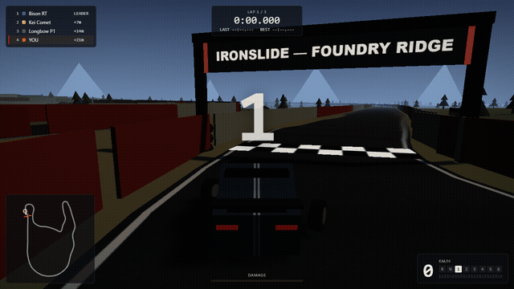

# IRONSLIDE

A physics-driven arcade racer in the browser. Four original cars, one 1.36 km
circuit with elevation, a hairpin, a chicane, an oil slick, gravel traps and a
dirt shortcut — built on Three.js for rendering and cannon-es for rigid-body
physics.



**[Play it now (GitHub Pages)](https://thefadghost.github.io/ironslide/)**

## Controls

| Input | Action |
| --- | --- |
| W / S or Up / Down | Throttle / brake (hold brake at standstill to reverse) |
| A / D or Left / Right | Steer |
| Space | Handbrake |
| C | Cycle camera (chase / hood / orbit) |
| R | Reset car to track |
| Esc | Pause |

Gamepad: left stick steers, RT/LT are throttle/brake, A is handbrake,
Y cycles camera, Menu pauses. Analog inputs are filtered with a deadzone
and an expo curve; keyboard and pad can be mixed freely.

## What's under the hood

- **Vehicle physics** — cannon-es `RaycastVehicle` at a fixed 120 Hz:
  per-wheel surface grip (tarmac / kerb / gravel / dirt / oil), traction-limited
  RWD drive force through a 6-speed auto gearbox with shift cut, speed-sensitive
  steering lock, downforce, drag, handbrake rear-grip reduction, damage that
  costs power, and a stability assist that deliberately yields when you
  counter-steer.
- **Track** — a Catmull-Rom circuit resampled to uniform 4 m arcs. Collision is
  a spatially partitioned trimesh (drivable surfaces) plus box wall colliders;
  surface type is analytic (projection + zones), so grip/audio/particles never
  guess from render meshes.
- **AI** — racing line from iterated curvature pull, backward-pass braking
  planner over live lookahead, pure-pursuit steering, headway-based car
  following, junction-aware avoidance, off-road homing and layered recovery.
  Rubber-banding vs the player is capped at ±7.5%.
- **Feedback** — impulse-scaled camera shake, FOV kick, chromatic aberration,
  mesh deformation on the hull, procedural WebAudio engine/tires/wind/impacts.
  Skid marks fade; dust, gravel spray, smoke and sparks are pooled particles.
- **Performance** — full-field sim step ≈0.6–1 ms; particle pools and skid
  buffers are preallocated; one draw call per system.

All assets (car bodies, liveries, textures, audio) are generated in code.
No third-party art or sound.

## Development

```bash
npm install
npm run dev      # vite dev server
npm run build    # typecheck + production bundle to dist/
npm test         # vitest: determinism, vehicle, race logic, track, collisions
npm run sim      # headless full-race telemetry run
```

The sim (`scripts/` + `tests/helpers/simHarness.ts`) runs complete AI-vs-AI
races headless and reports lap times, falls, resets and NaN checks — the same
harness backs the automated tests.

## License

[MIT](LICENSE)
